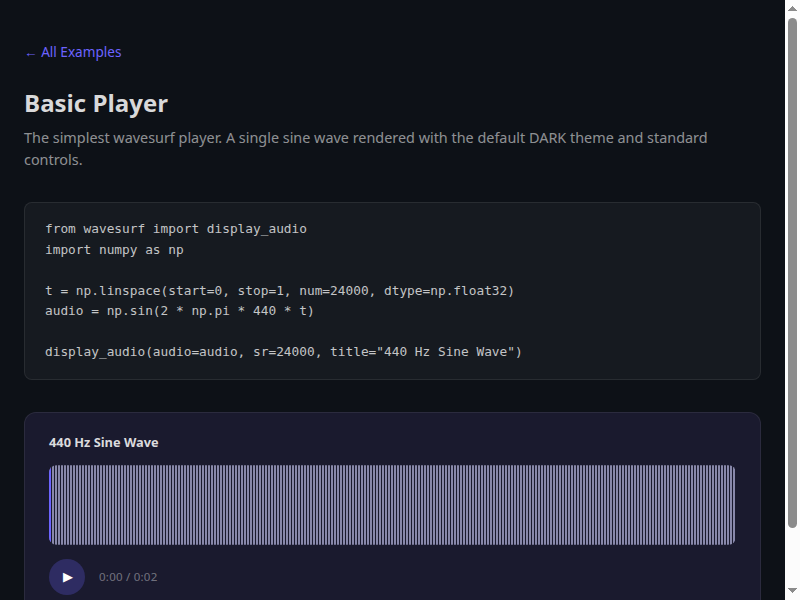
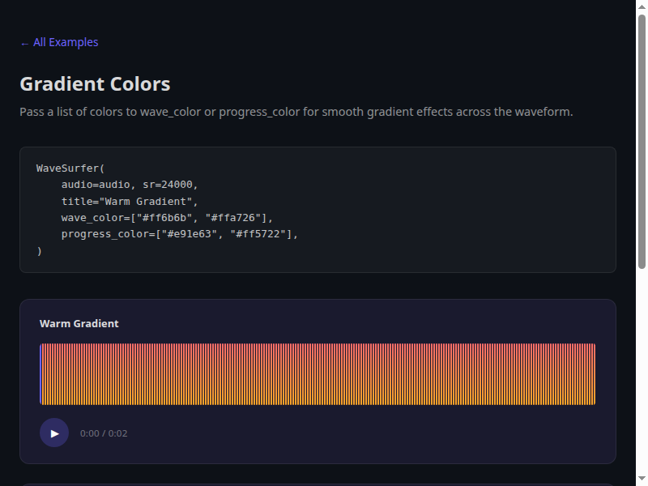
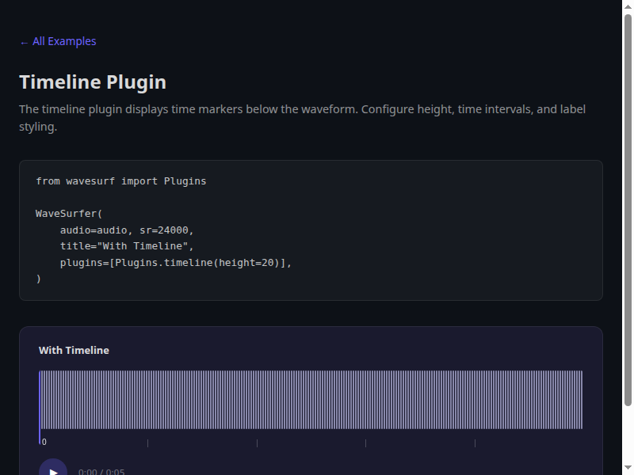
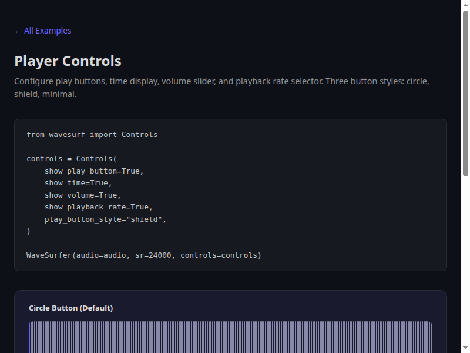
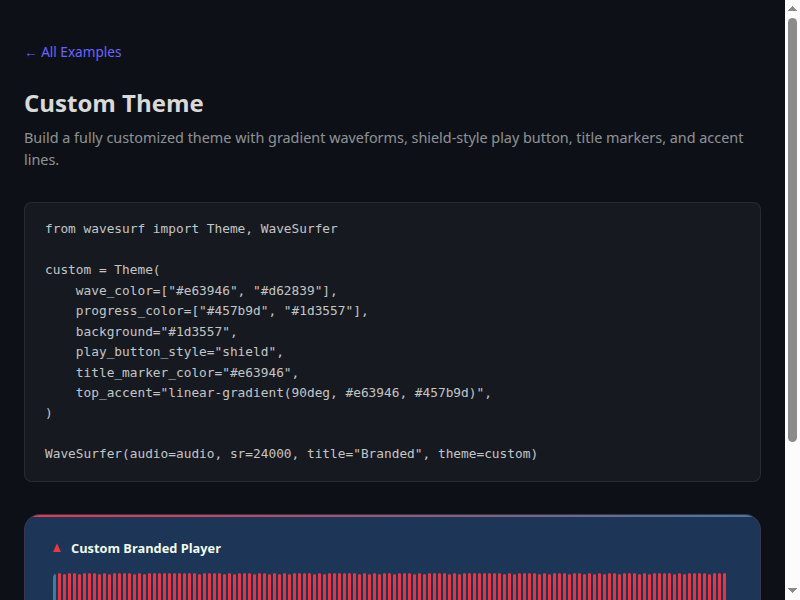
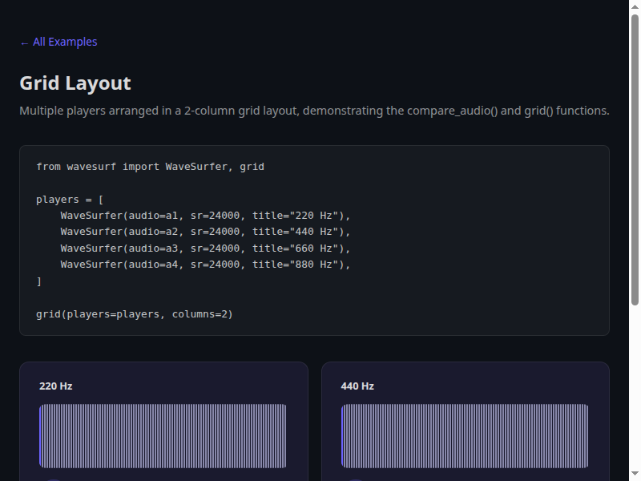
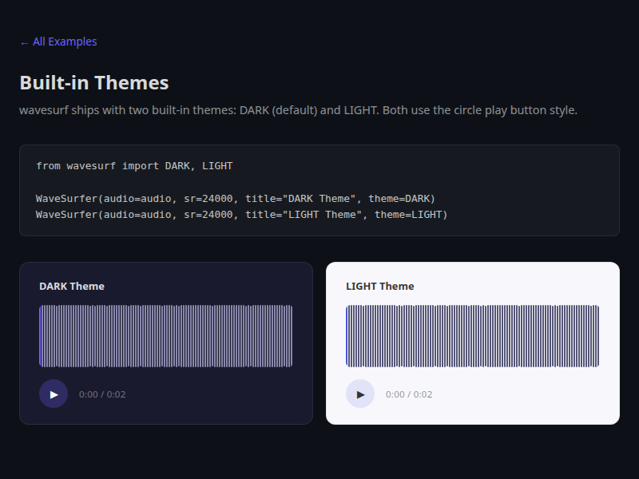

# wavesurf

A complete Python wrapper around [wavesurfer.js](https://wavesurfer.xyz/) for Jupyter notebooks.

[wavesurfer.js](https://wavesurfer.xyz/) is an open-source audio visualization library for building interactive, customizable waveform players. wavesurf brings its full power to Python -- pass a numpy array, torch tensor, file path, or URL and get a fully-featured audio player inline, complete with themes, plugins, custom controls, and event handlers. No JavaScript required.

## Gallery

| | |
|:---:|:---:|
| [](examples/basic.html) | [](examples/bars.html) |
| [Basic Player](examples/basic.html) | [Bar-Style Waveforms](examples/bars.html) |
| [](examples/gradients.html) | [](examples/timeline.html) |
| [Gradient Colors](examples/gradients.html) | [Timeline Plugin](examples/timeline.html) |
| [](examples/controls.html) | [](examples/custom_theme.html) |
| [Player Controls](examples/controls.html) | [Custom Theme](examples/custom_theme.html) |
| [](examples/layout.html) | [](examples/themes.html) |
| [Grid Layout](examples/layout.html) | [Built-in Themes](examples/themes.html) |

## Examples

Interactive HTML examples demonstrating all major features:

| Example | Description |
|---------|-------------|
| [Basic Player](examples/basic.html) | Simplest player with default DARK theme |
| [Bar-Style Waveforms](examples/bars.html) | Customize bar width, gap, and radius |
| [Gradient Colors](examples/gradients.html) | Gradient wave and progress colors |
| [Timeline Plugin](examples/timeline.html) | Time markers below the waveform |
| [Minimap Plugin](examples/minimap.html) | Miniature waveform overview |
| [Spectrogram Plugin](examples/spectrogram.html) | Frequency spectrum visualization |
| [Regions Plugin](examples/regions.html) | Highlight and annotate audio segments |
| [Player Controls](examples/controls.html) | Play, time, volume, and rate controls |
| [Grid Layout](examples/layout.html) | Multi-player comparison grids |
| [Custom Theme](examples/custom_theme.html) | Fully customized visual theme |
| [Built-in Themes](examples/themes.html) | DARK and LIGHT themes side by side |

Regenerate examples locally:

```bash
uv run python examples/generate_examples.py
```

## Features

- **Two-line quick start** -- `display_audio(audio=array, sr=24000)` renders a complete player
- **Four audio input types** -- numpy arrays, PyTorch tensors, file paths, and URLs
- **Two built-in themes** -- DARK and LIGHT, plus a theme registry for custom branded themes
- **Fully customizable themes** -- 25+ styling properties for waveform, container, buttons, and decorative elements
- **Flexible controls** -- play/pause, time display, volume slider, playback rate selector
- **22 event handlers** -- attach raw JavaScript callbacks to any wavesurfer.js event
- **Plugin support** -- timeline, minimap, regions, and spectrogram plugins
- **Comparison layouts** -- side-by-side and grid layouts for multi-player displays
- **Immutable builder pattern** -- chain `.with_theme()`, `.with_options()`, `.with_events()` fluently
- **JupyterLab compatible** -- iframe-based rendering bypasses JupyterLab's script stripping

## Installation

```bash
uv add wavesurf
```

## Quick Start

```python
from wavesurf import display_audio
import numpy as np

# Generate a 1-second sine wave
t = np.linspace(start=0, stop=1, num=24000, dtype=np.float32)
audio = np.sin(2 * np.pi * 440 * t)

display_audio(audio=audio, sr=24000, title="440 Hz Sine Wave")
```

The player auto-renders when it is the last expression in a notebook cell.

## Audio Input Types

wavesurf accepts four audio source formats:

### NumPy Arrays

```python
display_audio(audio=numpy_array, sr=24000, title="From NumPy")
```

Requires the `sr` (sample rate) parameter. Audio is encoded to a base64 WAV data-URL and embedded directly in the HTML.

### PyTorch Tensors

```python
display_audio(audio=torch_tensor, sr=24000, title="From PyTorch")
```

Tensors are automatically detected at runtime and converted to numpy. PyTorch is not required at import time.

### File Paths

```python
display_audio(audio="path/to/audio.wav", title="From File")
display_audio(audio=Path("path/to/audio.flac"), title="Path Object")
```

Files are loaded via soundfile (WAV, FLAC, OGG, etc.). The sample rate is read from the file header.

### URLs

```python
display_audio(audio="https://example.com/audio.wav", title="From URL")
```

URLs are passed through directly to wavesurfer.js — the audio is streamed by the browser, not downloaded by Python.

## Themes

### Built-in Themes

```python
from wavesurf import WaveSurfer, DARK, LIGHT

# Minimal dark theme (default)
WaveSurfer(audio=audio, sr=sr, theme=DARK)

# Clean light theme
WaveSurfer(audio=audio, sr=sr, theme=LIGHT)

# Themes can be referenced by name (string)
WaveSurfer(audio=audio, sr=sr, theme="light")
```

### Theme Registry

Register custom themes for reuse across your project:

```python
import wavesurf as ws

# Register a custom theme
my_brand = ws.Theme(
    wave_color=["#e63946", "#d62839"],
    progress_color=["#457b9d", "#1d3557"],
    background="#1d3557",
    play_button_style="shield",
    play_button_color="#f1faee",
    play_button_bg="linear-gradient(135deg, #e63946, #d62839)",
    title_color="#f1faee",
    time_color="rgba(241, 250, 238, 0.5)",
)
ws.themes.register(name="my-brand", theme=my_brand)

# Set as the global default — all subsequent calls use it automatically
ws.themes.enable(name="my-brand")

# Now every call uses my-brand without explicit theme= parameter
ws.display_audio(audio=audio, sr=sr, title="Branded Player")

# Or reference by name
ws.display_audio(audio=audio, sr=sr, theme="my-brand")

# List all registered themes
ws.themes.names()  # ['dark', 'light', 'my-brand']
```

### Custom Themes

Create a custom theme by modifying any built-in:

```python
from wavesurf import Theme, DARK

my_theme = DARK.replace(
    wave_color="#ff6b9d",
    progress_color="#00d9ff",
    background="#0a0e27",
    play_button_style="minimal",
)

WaveSurfer(audio=audio, sr=sr, theme=my_theme)
```

Or build one from scratch:

```python
my_theme = Theme(
    wave_color=["#e63946", "#d62839"],
    progress_color=["#457b9d", "#1d3557"],
    cursor_color="#457b9d",
    bar_width=3,
    bar_gap=2,
    bar_radius=3,
    height=80,
    background="#1d3557",
    border="1px solid rgba(230, 57, 70, 0.15)",
    title_color="#f1faee",
    play_button_style="shield",
    play_button_color="#1d3557",
)
```

### Theme Properties

| Category | Properties |
|----------|-----------|
| **Waveform** | `wave_color`, `progress_color`, `cursor_color`, `bar_width`, `bar_gap`, `bar_radius`, `height` |
| **Container** | `background`, `border`, `border_radius`, `padding`, `font_family` |
| **Title** | `title_color`, `title_font_size`, `title_font_weight`, `title_marker_color`, `title_marker_shape` |
| **Play button** | `play_button_style` (`"shield"` / `"circle"` / `"minimal"`), `play_button_color`, `play_button_bg`, `play_button_hover_glow` |
| **Time display** | `time_color` |
| **Decorative** | `top_accent`, `background_pattern`, `card_margin_bottom` |

## Controls

Configure the control bar beneath the waveform:

```python
from wavesurf import Controls, WaveSurfer

controls = Controls(
    show_play_button=True,       # play/pause button
    show_time=True,              # current time / duration
    show_volume=True,            # volume slider
    show_playback_rate=True,     # speed selector (0.5x - 2x)
    play_button_style="circle",  # override theme button style
    layout="bottom",             # "bottom" or "top"
)

WaveSurfer(audio=audio, sr=sr, controls=controls)
```

### Button Styles

- `"shield"` -- badge shape with gradient fill
- `"circle"` -- rounded button (default for DARK/LIGHT themes)
- `"minimal"` -- text-only play triangle

## Events

Attach JavaScript callbacks to any of wavesurfer.js's 22 events:

```python
from wavesurf import EventHandler, WaveSurfer

# Shorthand for the ready event
player = WaveSurfer(
    audio=audio, sr=sr,
    on_ready="console.log('Duration:', duration);",
)

# Multiple event handlers
player = WaveSurfer(
    audio=audio, sr=sr,
    events=[
        EventHandler.on_play(js="console.log('Playing');"),
        EventHandler.on_pause(js="console.log('Paused');"),
        EventHandler.on_audioprocess(js="console.log('Time:', currentTime);"),
        EventHandler.on_ready(js="console.log('Ready');", once=True),
    ],
)
```

### All Events

| Event | Callback Parameters | Description |
|-------|-------------------|-------------|
| `on_init` | *(none)* | Player initialized |
| `on_load` | `url` | Audio URL set |
| `on_loading` | `percent` | Loading progress |
| `on_decode` | `duration` | Audio decoded |
| `on_ready` | `duration` | Ready for playback |
| `on_play` | *(none)* | Playback started |
| `on_pause` | *(none)* | Playback paused |
| `on_finish` | *(none)* | Playback ended |
| `on_audioprocess` | `currentTime` | Playback progressing |
| `on_timeupdate` | `currentTime` | Time updated (throttled) |
| `on_seeking` | `currentTime` | Seeking to position |
| `on_interaction` | `newTime` | User interaction |
| `on_click` | `relativeX`, `relativeY` | Waveform clicked |
| `on_dblclick` | `relativeX`, `relativeY` | Waveform double-clicked |
| `on_drag` | `relativeX` | Dragging playback cursor |
| `on_dragstart` | `relativeX` | Drag started |
| `on_dragend` | `relativeX` | Drag ended |
| `on_scroll` | `visibleStartTime`, `visibleEndTime`, `scrollLeft`, `scrollRight` | Waveform scrolled |
| `on_zoom` | `minPxPerSec` | Zoom level changed |
| `on_redraw` | *(none)* | Waveform redrawn |
| `on_redrawcomplete` | *(none)* | Redraw finished |
| `on_error` | `error` | Error occurred |
| `on_destroy` | *(none)* | Player destroyed |

## Plugins

Register wavesurfer.js plugins using the `Plugins` factory:

```python
from wavesurf import Plugins, WaveSurfer

player = WaveSurfer(
    audio=audio, sr=sr,
    plugins=[
        Plugins.timeline(height=20),
        Plugins.minimap(height=40, overlay=True),
        Plugins.regions(),
        Plugins.spectrogram(height=128, labels=True),
    ],
)
```

### Built-in Plugin Factories

```python
Plugins.timeline(height=20, time_interval=None, primary_label_interval=None,
                 secondary_label_interval=None, style=None)

Plugins.minimap(height=20, wave_color=None, progress_color=None, overlay=True)

Plugins.regions()

Plugins.spectrogram(height=128, labels=True, color_map=None)
```

### Custom Plugins

```python
from wavesurf import PluginConfig

custom = PluginConfig(
    name="MyPlugin",
    options={"someOption": "value"},
    js_source="https://cdn.example.com/my-plugin.js",
)
```

## Layouts

### Single Player

```python
from wavesurf import display_audio

display_audio(audio=audio, sr=24000, title="Single Player")
```

### Side-by-Side Comparison

```python
from wavesurf import compare_audio

compare_audio(
    audio_dict={
        "Original": (audio_orig, 24000),
        "Processed": (audio_proc, 24000),
    },
    columns=1,  # vertical stack (default)
)
```

Values can be plain arrays (with a shared `sr` parameter) or `(array, sr)` tuples for mixed sample rates.

### Grid Layout

```python
from wavesurf import WaveSurfer, grid

players = [
    WaveSurfer(audio=a1, sr=24000, title="Track 1"),
    WaveSurfer(audio=a2, sr=24000, title="Track 2"),
    WaveSurfer(audio=a3, sr=24000, title="Track 3"),
    WaveSurfer(audio=a4, sr=24000, title="Track 4"),
]

grid(players=players, columns=2)  # 2x2 grid
```

## Builder Pattern

Create variants of a player without modifying the original:

```python
from wavesurf import WaveSurfer, EventHandler, Plugins, LIGHT

base = WaveSurfer(audio=audio, sr=24000, title="Base")

# Chain immutable builder methods
enhanced = (
    base
    .with_theme(theme=LIGHT)
    .with_options(bar_width=5, height=120)
    .with_events(EventHandler.on_ready(js="console.log('ready');"))
    .with_plugins(Plugins.timeline())
)
```

Available builder methods:

- `.with_options(**kwargs)` -- add or override wavesurfer.js options
- `.with_theme(theme)` -- switch the visual theme
- `.with_events(*handlers)` -- append event handlers
- `.with_plugins(*configs)` -- append plugins

## All wavesurfer.js Options

Any wavesurfer.js option can be passed as a snake_case keyword argument:

```python
WaveSurfer(
    audio=audio, sr=24000,
    bar_width=3, bar_gap=2, bar_radius=3,
    height=100, normalize=True,
    drag_to_seek=True, interact=True,
)
```

| Python (snake_case) | JavaScript (camelCase) | Type |
|--------------------|----------------------|------|
| `audio_rate` | `audioRate` | `float` |
| `auto_center` | `autoCenter` | `bool` |
| `auto_scroll` | `autoScroll` | `bool` |
| `autoplay` | `autoplay` | `bool` |
| `backend` | `backend` | `"WebAudio"` / `"MediaElement"` |
| `bar_align` | `barAlign` | `"top"` / `"bottom"` |
| `bar_gap` | `barGap` | `int` |
| `bar_height` | `barHeight` | `float` |
| `bar_radius` | `barRadius` | `int` |
| `bar_width` | `barWidth` | `int` |
| `blob_mime_type` | `blobMimeType` | `str` |
| `csp_nonce` | `cspNonce` | `str` |
| `cursor_color` | `cursorColor` | `str` |
| `cursor_width` | `cursorWidth` | `int` |
| `drag_to_seek` | `dragToSeek` | `bool` / `dict` |
| `duration` | `duration` | `float` |
| `fetch_params` | `fetchParams` | `dict` |
| `fill_parent` | `fillParent` | `bool` |
| `height` | `height` | `int` / `"auto"` |
| `hide_scrollbar` | `hideScrollbar` | `bool` |
| `interact` | `interact` | `bool` |
| `media_controls` | `mediaControls` | `bool` |
| `min_px_per_sec` | `minPxPerSec` | `int` |
| `normalize` | `normalize` | `bool` |
| `progress_color` | `progressColor` | `str` / `list[str]` |
| `render_function` | `renderFunction` | `str` (raw JS) |
| `sample_rate` | `sampleRate` | `int` |
| `split_channels` | `splitChannels` | `list[dict]` |
| `url` | `url` | `str` |
| `wave_color` | `waveColor` | `str` / `list[str]` |
| `width` | `width` | `int` / `str` |

## Testing

wavesurf uses two test layers:

### Python Unit Tests (103 tests)

```bash
uv run pytest tests/ --verbose
```

Covers options mapping, audio encoding/decoding, HTML generation, theme application, event handlers, core class behavior, and edge cases (XSS, empty audio, single samples, UID uniqueness).

### Cypress Browser Tests

```bash
npm install
npm run test:e2e
```

Verifies waveform rendering, playback controls, visual regression across themes, comparison grid layouts, and all example pages (DOM structure + visual regression) in a real browser.

### Both Layers

```bash
bash scripts/run_tests.sh
```

## API Reference

### Classes

| Class | Description |
|-------|------------|
| `WaveSurfer` | Main player class with `_repr_html_()` for Jupyter display |
| `Theme` | Frozen dataclass with 25+ visual styling properties |
| `ThemeRegistry` | Named theme registry with global default and string-based selection |
| `Controls` | Configuration for the player control bar |
| `EventHandler` | Single event handler with JS callback and `once` flag |
| `PluginConfig` | Configuration for a wavesurfer.js plugin |
| `Plugins` | Factory class with static methods for common plugins |
| `WaveSurferOptions` | All 31 wavesurfer.js options in snake_case |

### Functions

| Function | Description |
|----------|------------|
| `display_audio(audio, sr, *, title, theme, controls, **options)` | Quick single-player display (`theme` accepts `Theme` object or string name) |
| `compare_audio(audio_dict, sr, *, columns, theme, controls, **options)` | Multi-player comparison |
| `compare(players, columns)` | Layout helper for `WaveSurfer` instance lists |
| `grid(players, columns)` | Alias for `compare()` with 2-column default |

### Built-in Themes

| Theme | Style |
|-------|-------|
| `DARK` | Dark background, purple accents, circle play button |
| `LIGHT` | Light background, blue accents, circle play button |
